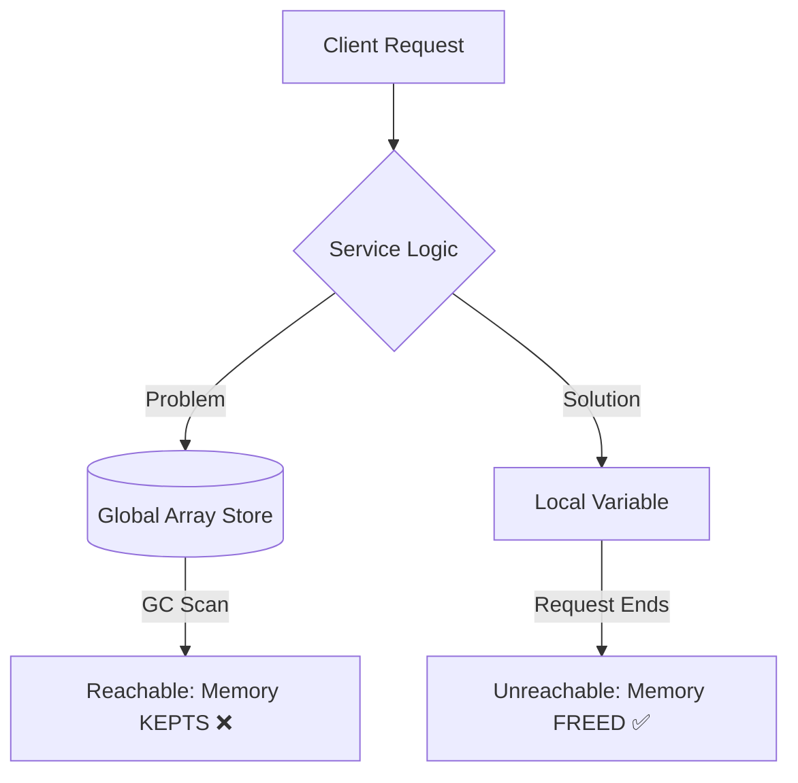
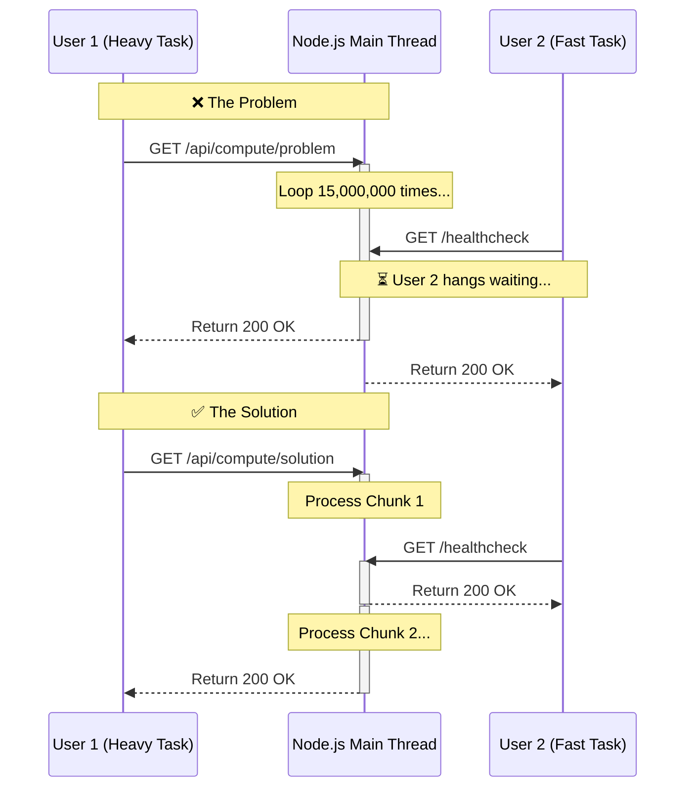
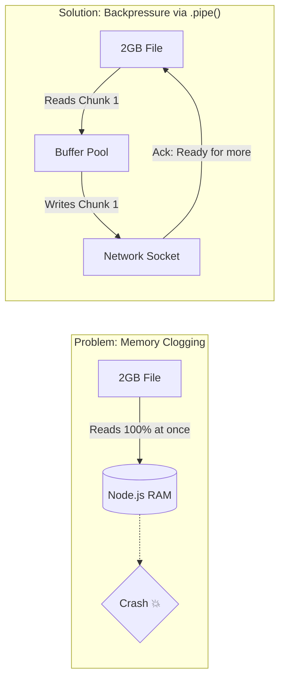

# The Leaky Pipe: Node.js Performance Gotchas 🚀

Welcome to **The Leaky Pipe**!

This repository is a comprehensive, hands-on tutorial designed to help you understand and mitigate the three most critical perfromance pitfalls in Node.js applications:

1. 🧠 **Memory Leaks** (V8 Garbage Collection Failures)
2. 🛑 **Event Loop Blocking** (CPU-Heavy Synchronous Tasks)
3. 🚰 **Stream Backpressure** (Memory Overflows during I/O)

I have structured this as a real-world **Express.js API**, allowing you to trigger the "Problem" and the "Solution" for each scenario side-by-side!

---

## 🏃 Getting Started

### Prerequisites

- [Node.js](https://nodejs.org/) (v18+)
- [pnpm](https://pnpm.io/)

### Installation & Running

```bash
# 1. Install dependencies
pnpm install

# 2. Start the development server (automatically uses --expose-gc)
pnpm dev
```

The server will start on `http://localhost:3333` and print a colorful dashboard via `gach`.

---

## 🧠 Issue 1: Memory Leaks (The Global Black Hole)

Node.js manages memory using the **V8 Garbage Collector (GC)**. The GC periodically scans memory for objects that are no longer "reachable" from the root (global state) and frees up that memory.

If you attach data to a global variable (like a caching array or object) and never clean it up, the GC can never free it. Over time, your application will crash with a `JavaScript heap out of memory` error.

### The Problem (`/api/leaks/problem`) vs The Solution (`/api/leaks/solution`)

| Approach     | Where Data is Stored                | GC Behavior                          | Memory Footprint             | Test Results (`npm run spam:*`)                    |
| ------------ | ----------------------------------- | ------------------------------------ | ---------------------------- | -------------------------------------------------- |
| **Problem**  | Global `Array` (`const store = []`) | ❌ Cannot be collected (`Reachable`) | Grows infinitely until crash | RSS: 1.30GB+ / Heap: 1.10GB+ (Node memory limits)  |
| **Solution** | Local request scope                 | ✅ Collected after request ends      | Stable                       | RSS: 350MB max / Heap: <15MB active (Safely swept) |

### Architectural Flow



### Try it (Automated Spam Scripts & GC):

We've exposed the V8 Garbage Collector using the `--expose-gc` flag in the `dev` script to manually force memory cleanup in the code to prove the leak. You can use the included spam scripts to test the behavior!

Open a **new terminal window** while your dev server is running, and try both:

**Test the Safe Solution (Survives):**

```bash
pnpm run spam:safe
```

Watch the server terminal! You'll see RSS grow, but `Heap Used` will periodically drop back down to baseline as `global.gc()` safely cleans up the local variables.

**Test the Memory Leak (Crashes):**

```bash
pnpm run spam:leak
```

Within ~20 requests, `Heap Used` will climb uncontrollably. The Garbage Collector will panic, fail to clean up the global store, and crash your server with a `FATAL ERROR: JavaScript heap out of memory`.

---

## 🛑 Issue 2: Event Loop Blocking (The Sync Trap)

Node.js is fundamentally **Single-Threaded** for executing JavaScript. It uses an **Event Loop** to juggle thousands of concurrent network connections asynchronously.

However, if you write a massive, CPU-intensive `for` loop, you monopolize that **single thread**. All other incoming HTTP requests will be forced to wait until that `for` loop finishes.

### The Problem (`/api/compute/problem`) vs The Solution (`/api/compute/solution`)

| Approach     | Execution Strategy                     | Event Loop Status     | Concurrent Requests      | Test Results (`npm run spam:block *`) |
| ------------ | -------------------------------------- | --------------------- | ------------------------ | ------------------------------------- |
| **Problem**  | Synchronous heavy `for`-loop           | 🔴 Blocked completely | Must wait (Timeout risk) | Healthcheck pings freeze for ~1.5s    |
| **Solution** | Asynchronous chunking (`setImmediate`) | 🟢 Unblocked          | Served immediately       | Healthcheck pings return in ~2ms!     |

### Architectural Flow



### Try it (Event Loop Responsiveness Test):

We have included a spam script that fires off the heavy compute endpoint while simultaneously pinging the server's root healthcheck (`GET /`) every 300ms.

Open a **new terminal window** while your dev server is running, and try both:

**Test the Memory Block (Problem):**

```bash
pnpm run spam:block problem
```

Notice how ALL the healthcheck pings completely freeze, and only return _after_ the massive 50 million iteration loop finishes? Your server was completely unresponsive during that 2-4 second window!

**Test the Chunked Solution:**

```bash
pnpm run spam:block solution
```

Notice how the healthcheck pings immediately return `🟢 Responded in Xms` even while the heavy computation is running in the background! Node.js is actively juggling both requests.

---

## 🚰 Issue 3: Stream Backpressure (The Burst Pipe)

When dealing with large files, networking, or video processing, data flows in **Streams**.

If a Readable stream (reading a file from disk) pushes data faster than a Writable stream (sending data over a slow WiFi network) can handle, the data must be buffered in memory. This is called **Backpressure**. If untreated, it causes OOM (Out of Memory) crashes.

### The Problem (`/api/streams/problem`) vs The Solution (`/api/streams/solution`)

| Approach     | Strategy                                    | Memory Usage  | Risk                | Test Results (`npm run spam:stream *`)    |
| ------------ | ------------------------------------------- | ------------- | ------------------- | ----------------------------------------- |
| **Problem**  | `fs.readFile` (Buffer entire file into RAM) | Massive       | ❌ Node Crash (OOM) | Memory spike, Time: 1.39s (If survives)   |
| **Solution** | `fs.createReadStream().pipe(res)`           | Tiny (Chunks) | ✅ Safe & Fast      | Stable memory, Time: 0.52s (270% Faster!) |

### Architectural Flow



### Try it (Memory Overflow Test):

We have included a script that downloads the dummy file via the API but prints running totals of the downloaded data, rather than trying to store it.

Open a **new terminal window** while your dev server is running, and try both:

**Test the Memory Crash (Problem):**

```bash
pnpm run spam:stream problem
```

The server will attempt to load the entire 500MB file into a V8 Buffer at once using `fs.readFile()`. Because V8 has strict string buffer length limits (typically around ~250MB for single strings/buffers), the server will instantly crash with an `ERR_FS_FILE_TOO_LARGE` or `OOM` error!

**Test the Safe Pipe (Solution):**

```bash
pnpm run spam:stream solution
```

Watch the terminal! The server creates a `fs.createReadStream().pipe()` which reads the file chunk by chunk (typically 64kb at a time). It naturally respects the HTTP network speed and successfully streams the entire 500MB file to the client without crashing your server's memory!

---

## 🤝 Contributing

Want to add an example of `process.nextTick` vs `setImmediate`? Or `Worker Threads`? PRs are welcome!
